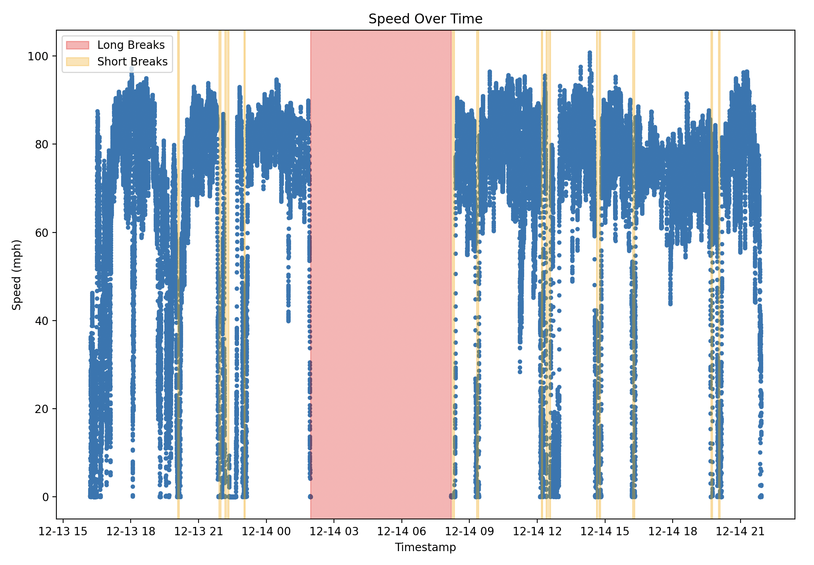

# GPS Parser

VAVA Dashcams are equipped with GNSS receivers and write data directly to the micro-SD card when it is powered. GPRMC sentences are written to a log file each second with position and speed data of the dashcam. This data is interesting as it tracks where the vehicle has been; especially for long car trips.

Using this data, we can quickly extract max speed over a trip, average moving speed, and distance traveled. We can also make pretty plots of our trip on a map. Doing a bit more math, we can also differentiate between short and long breaks during a trip, gas efficiency, etc.

Look at this graph!

This graph shows the speed against time during a recent car trip I took. The yellow regions represent short breaks that were taken to fuel up or take a break, and the red zone was a long break to rest overnight. This map is somewhat incriminating as it also shows how fast we were going on this trip (oops).
